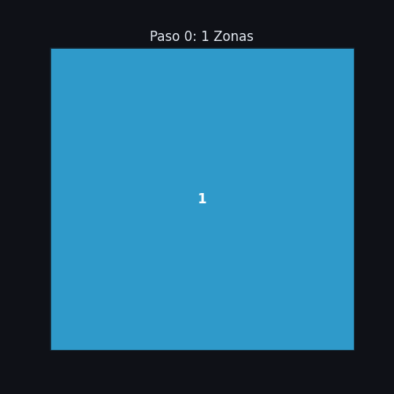
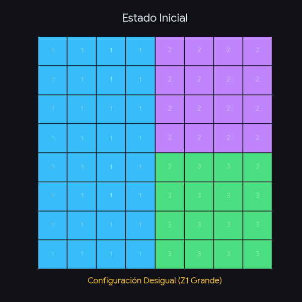
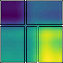

# Algoritmo Simulated Annealing
## Optimización del Sensor Positioning Problem (SPP)
**Autor:** Sebastián Andrés Richiardi Pérez
**Fecha:** 27 de Noviembre 2025
**Repositorio:** [github.com/KroderDev/sensor-positioning-problem](https://github.com/KroderDev/sensor-positioning-problem
)

----

## Introducción

**El Problema (SPP):**
El objetivo es determinar la ubicación óptima de $p$ sensores (o zonas de manejo) en un terreno agrícola representado por una matriz de datos $N \times M$.

**Objetivo del Algoritmo:**
Minimizar el error cuadrático medio intra-zona, sujeto a restricciones de:

1.  **Homogeneidad:** La varianza interna no debe superar un umbral $\alpha$.
2.  **Conexidad:** Las zonas deben ser contiguas.
3.  **Forma:** Se establecen formas rectangulares (zonas de manejo operables).

**Implementación:**
Una metaheurística de **Simulated Annealing (SA)** en C++17, utilizando OpenCV para visualización y JSON para configuración.

-----

## Lectura de Archivos & IO

El sistema de Entrada/Salida (`IO.cpp`) maneja la carga de datos y parámetros.

**Entradas:**

1.  **Instancia (`.spp`):** Dimensiones $N, M$ y matriz de valores $S$ (NDVI, pH, etc.).
2.  **Configuración (`.json`):** Parámetros del algoritmo (Temperaturas, Iteraciones).
3.  **Parámetros de Ejecución (Consola):** Cantidad de zonas $p$ y factor de homogeneidad $\alpha$.

-----

## Lectura de Archivos & IO

**Pseudocódigo de Carga (IO.cpp):**

```text
Estructura ProblemInstance:
    S: Matriz[N][M] de doubles
    p: entero (zonas)
    alpha: double (restricción varianza)

IO::readInstanceFromFile(path):
    Abrir archivo .spp
    Leer N, M y matriz S celda por celda

IO::readParamsFromConsole(inst):
    Pedir p y alpha por stdin y guardarlos en inst

IO::readConfigFromJson(path):
    Construir SAConfig (T0, Tf, max_iterations, iters_per_temp,
    cooling_factor, max_time_seconds, penalty_weight)
```

-----

## Ejecución General

El flujo principal (`main.cpp`) orquesta los componentes.

**Flujo de Control:**

1.  Carga de instancia y parámetros de usuario.
2.  Carga de configuración SA desde JSON.
3.  Generación de **Solución Inicial**.
4.  Ejecución del **Simulated Annealing**.
5.  Exportación de resultados:
      - Archivo `.out` con matriz de etiquetas.
      - Imagen `.png` (Heatmap con bordes superpuestos usando OpenCV).

-----

## Representación de la Solución

La solución se modela discretamente para permitir operaciones rápidas sobre la matríz.

**Estructura de Datos (`Solution.hpp`):**

```cpp
struct Solution {
    // Matriz de tamaño NxM. 
    // Z[i][j] = k, donde k es el ID de la zona (1..p)
    vector<vector<int>> Z; 
    
    // Valor objetivo (suma de errores cuadráticos)
    double errorTotal; 
};
```

**Ventaja:**
Esta representación permite verificar vecinos y calcular varianzas iterando directamente sobre la matriz, facilitando la implementación de restricciones de adyacencia.

-----

## Algoritmo - Solución Inicial

Para comenzar con una solución válida y razonable, se utiliza una heurística constructiva basada en cortes tipo "Guillotina".

**Procedimiento (`buildInitialSolution`):**
El objetivo es dividir el terreno recursivamente hasta obtener $p$ rectángulos.

-----

## Algoritmo - Solución Inicial

**Pseudocódigo:**

```text
// buildInitialSolution(instance)
Lista rectangulos = { Rectangulo(0, 0, N-1, M-1) }

Mientras tamaño(rectangulos) < p:
    r = rectangulo de mayor área

    Si (r.alto >= 2 O r.ancho >= 2):
        corte = Horizontal/Vertical aleatorio
        r1, r2 = Dividir r en corte
        Reemplazar r con r1 y r2 en la lista
    Sino:
        break // no se puede dividir más

Asignar IDs 1..p sobre la matriz Z según los rectángulos
Calcular Error Inicial con calculateErrorAndVariance()
```

-----

## Configuración SA

El comportamiento del recocido se define externamente (`data/config/default.json`) para facilitar el ajuste de parámetros sin recompilar.

**Parámetros Clave:**

  - **Esquema de Enfriamiento:** Geométrico ($T_{k+1} = T_k \cdot \text{cooling\_factor}$).
  - **Penalización:** Peso $W$ para violaciones de varianza.

**Ejemplo de Configuración:**

```json
{
  "T0": 1000.0,            // Temp. Inicial
  "Tf": 0.001,             // Temp. Final
  "max_iterations": 100000,// Limite iteraciones
  "iters_per_temp": 100,   // Iteraciones por nivel de temp
  "cooling_factor": 0.95,  // Velocidad de enfriamiento
  "max_time_seconds": 10.0,// Tiempo maximo por corrida
  "penalty_weight": 1000.0 // Costo por violar varianza
}
```


-----

## Función de Evaluación (Energía)

El algoritmo permite explorar soluciones infactibles (que violan la varianza máxima) mediante una función de costo penalizada.

**Función de Energía:**
$$E(Z) = \text{ErrorTotal}(Z) + W \cdot \text{Penalizaci\'on}(Z)$$

**Cálculo de Penalización (`calculateVariancePenalty`):**

```text
VarianzaTotalGlobal = calculateTotalVariance(S)
Limite = alpha * VarianzaTotalGlobal
Penalizacion = 0

Para cada zona k en 1..p (según calculateErrorAndVariance):
    Si counts[k] == 0:
        ...
```


-----
## Función de Evaluación (Energía)

**Cálculo de Penalización (`calculateVariancePenalty`):**

```text
VarianzaTotalGlobal = calculateTotalVariance(S)
Limite = alpha * VarianzaTotalGlobal
Penalizacion = 0

Para cada zona k en 1..p (según calculateErrorAndVariance):
    Si counts[k] == 0:
        Penalizacion += Limite   // zona vacía
    Si varianza(k) > Limite:
        Penalizacion += (varianza(k) - Limite)

Retornar Penalizacion (calculateVariancePenalty)
```

*Nota:* Esto guía al algoritmo suavemente de regreso a la región factible si se sale.

-----
## Generación de Vecindario

El operador de movimiento es crítico para mantener la forma de las zonas. No se mueven píxeles aleatorios, sino **límites de zonas**.

**Generación de Vecino (`generateNeighbor`):**

1.  Seleccionar una zona $k$ aleatoria.
2.  Calcular su *Bounding Box* (límites actuales).
3.  Elegir una dirección (Arriba, Abajo, Izquierda, Derecha) y una acción (Expandir o Contraer).
4.  **Acción:** Mover la frontera de la zona en la dirección elegida, "robando" o "cediendo" celdas a las zonas adyacentes.
5.  Validar conexidad con `isPartitionConnected`; si falla, se descarta el vecino.
6.  Reparar forma con `makeRectsIfNonOverlapping` (solo si los bounding boxes no se solapan).

----

## Generación de Vecindario

**Reparación de Forma (`makeRectsIfNonOverlapping`):**
Tras el movimiento, se intenta forzar que la zona resultante sea un rectángulo perfecto (su Bounding Box) si esto no genera solapamientos. Esto mantiene las zonas limpias y operables.

-----

## Algoritmo - Simulated Annealing

```text
Solucion actual = buildInitialSolution(instancia)
VarGlobal = calculateTotalVariance(instancia)

Si !isSolutionValid(actual.Z, VarGlobal):
    Repetir hasta 1000 veces:
        vecino = generateNeighbor(actual)
        Si isSolutionValid(vecino, VarGlobal):
            actual = vecino; break

Calcular energia actual = error + W*penalty
mejor = actual
T = T0

Mientras T > Tf Y iteraciones < max Y tiempo < max_time_seconds:
    Para i = 0 hasta iters_per_temp:
        vecino = generateNeighbor(actual)
        Si NO isPartitionConnected(vecino): Continuar
        Si !makeRectsIfNonOverlapping(vecino): Continuar

        Energia vecino = error + W*penalty (calculateErrorAndVariance + calculateVariancePenalty)
        Delta = Energia vecino - Energia actual
        Si (Delta < 0) O (Random(0,1) < exp(-Delta / T)):
            actual = vecino
            Energia actual = Energia vecino
        Si Energia actual < Energia mejor:
            mejor = actual

    T = T * cooling_factor
```

-----

## Resultados: Definición de la Instancia

Para validar el algoritmo, utilizamos una matriz sintética de $5 \times 5$ con gradientes de valor claros.

**Datos de Entrada (Matriz $S$) &rarr;**

Observamos tres regiones distinguibles: valores bajos (8-9) arriba-izq, medios (15-20) y altos (30+) abajo-der.

----

## Resultados: Definición de la Instancia

**Configuración de Ejecución:**

  - **Zonas ($p$):** 5
  - **Alpha ($\alpha$):** 0.2 (Restricción estricta de homogeneidad)
  - **SA Config:** Default (Enfriamiento geométrico)

-----


## Resultados: Solución Inicial (Heurística)

La solución inicial se genera mediante cortes recursivos (tipo guillotina) buscando maximizar el área, sin considerar los valores del suelo.

**Métrica:**

  - **Error Total (SSE):** `640.287`

**Análisis Crítico:**
El error es alto porque la Zona 1 (columna izquierda) agrupa valores muy dispares: mezcla el **8.2** (fila 1) con el **22.2** (fila 5). La geometría es correcta, pero la varianza interna es inaceptable.

-----

## Resultados: Solución Optimizada

Tras la ejecución del Simulated Annealing, el algoritmo reorganizó los límites buscando homogeneidad.

**Métrica:**

  - **Error Total (SSE):** `24.5767`

**Análisis de Mejora:**

  * **Reducción del error:** \~96% respecto a la inicial.
  * **Coherencia:** La Zona 1 ahora captura exclusivamente la esquina superior izquierda (valores 8.2 - 9.4), eliminando la contaminación de valores altos.

-----

## Resultados: Solución Optimizada

**Métrica:**

  - **Error Total (SSE):** `24.5767`

**Análisis de Mejora:**

  - **Reducción del error:** \~96% respecto a la inicial.
  - **Coherencia:** La Zona 1 ahora captura exclusivamente la esquina superior izquierda (valores 8.2 - 9.4), eliminando la contaminación de valores altos.
  - **Adaptabilidad:** Las zonas 4 y 5 se ajustaron horizontalmente para segregar el gradiente más fuerte en la parte inferior.

-----


## Resultados: Visualización

La segmentación final representada como mapa de calor sobre la matríz.

**Interpretación Visual:**

  * Las líneas representan las fronteras generadas por el algoritmo.
  * Se observa una correlación válida entre los colores (valores del suelo) y las regiones delimitadas.
  * Se cumple la restricción de **conexidad** y se mantienen formas rectangulares operables, a pesar de la estocasticidad del SA.

----

## Experimentos y Análisis Cuantitativo

Se evaluó el algoritmo en **15 instancias** clasificadas por tamaño, imponiendo $\alpha = 0.3$.

| Escenario | Grilla Aprox. | Zonas ($p$) | Instancias |
| :--- | :---: | :---: | :---: |
| **Pequeño** | $5 \times 5$ a $9 \times 7$ | 8 | 7 |
| **Mediano** | $15 \times 15$ | 15 | 5 |
| **Grande** | $30 \times 26$ | 20 | 5 |

----

## Resultados Cuantitativos

Resumen de mejora promedio del Error Cuadrático (SSE) respecto a la solución inicial (Guillotina):

| Escenario | Complejidad | Mejora Promedio (SSE) |
| :--- | :---: | :---: |
| **Instancias Pequeñas** | Baja | **39.8%** |
| **Instancias Medianas** | Media | **12.5%** |
| **Instancias Grandes** | Alta | **4.3%** |

> **Nota:** En instancias pequeñas, la mejora llegó hasta un 98% en casos específicos.

----

## Análisis de Resultados

1.  **Efectividad en Baja Escala:** El algoritmo es extremadamente efectivo corrigiendo soluciones iniciales en grillas pequeñas.
2.  **Desafío en Alta Escala:** En instancias grandes, la mejora del 4.3% indica que el espacio de búsqueda es vasto y el vecindario (mover 1 frontera a la vez) puede ser limitante para escapar de óptimos locales en el tiempo dado.
3.  **Robustez:** En todos los casos, el algoritmo entregó soluciones válidas (conexas y rectangulares) cumpliendo las restricciones de varianza.

----

## Conclusiones y Discusión

**Proceso de Desarrollo:**
1.  Diseño de pseudocódigo centrado en la estructura de vecindario.
2.  Implementación modular (IO, Config) y traducción a C++17.
3.  Refinamiento de operadores geométricos para garantizar la forma rectangular.

**Hallazgos Principales:**
-   **Eficacia de la Penalización:** Permitir soluciones intermedias infactibles evita el estancamiento en óptimos locales, superando la rigidez de los métodos constructivos puros.
-   **Robustez:** El algoritmo demostró capacidad para "rescatar" zonificaciones iniciales deficientes, reduciendo drásticamente el error (SSE) independientemente de la calidad de la entrada.
-   **Costo-Beneficio:** Mientras la heurística (Guillotina) es rápida pero imprecisa, el SA ofrece un balance ajustable entre tiempo de cómputo y calidad de homogeneidad.

----

## Trabajo Futuro

Para escalar el algoritmo a instancias productivas reales, se proponen las siguientes líneas de mejora:

* **Vecindario Avanzado (Split & Merge):**
    Implementar operaciones topológicas complejas (dividir una zona y fusionar otras dos) para diversificar la búsqueda en instancias grandes donde el movimiento de fronteras es lento.

* **Objetivo Multi-criterio:**
    Extender la función de costo para balancear homogeneidad no solo con la varianza, sino con restricciones operativas reales: tamaño mínimo de zona y regularidad geométrica (evitar zonas muy delgadas).

* **Integración de Localización:**
    Incorporar la determinación del punto óptimo de muestreo (centroide/mediana) dentro del ciclo de optimización, resolviendo el problema SPP completo (Zonificación + Localización) en una sola ejecución.

----
## Referencias

- Huguet, F., Plà-Aragonés, L. M., Albornoz, V. M., & Pohl, M. (2025). **A Genetic Algorithm for Site-Specific Management Zone Delineation**. Mathematics, 13(7), 1064. https://doi.org/10.3390/math13071064

- Torres Herrera, T. B. (2023). **Modelo de Localización de Sensores para la Agricultura de Precisión** (Tesis de Magíster en Ciencias de la Ingeniería). Universidad Técnica Federico Santa María, Chile.

- Cid-García, N. M., Albornoz, V. M., Ortega, R., & Ríos-Solís, Y. A. (2013). **Rectangular shape management zone delineation using integer linear programming**. *Computers and Electronics in Agriculture*, *93*, 1–9. https://doi.org/10.1016/j.compag.2013.01.009

<!-- Localización Torres Herrera, Movimiento y reconstrucción: Idea Huget, Albornoz -->